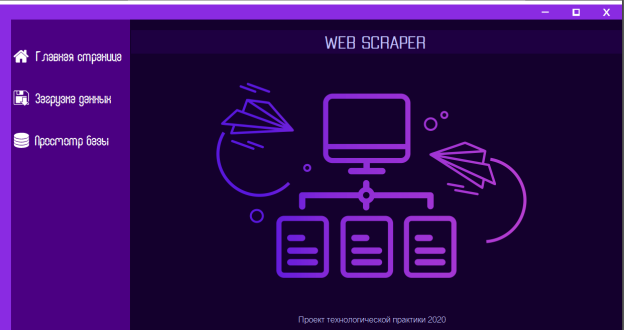

# Procurement web parser

## `UI`

The base UI looks like then (WinForms app):

## `Used dll's`

- Regular Expressions
- HtmlAgilityPack
- Try to use Selenium, but changed my mind

---

Creared in 2020 year.
